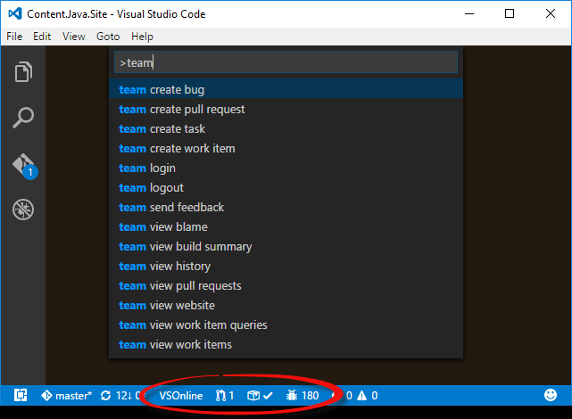
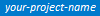

# Azure Repos Extension for Visual Studio Code


This extension allows you to connect to Azure DevOps Services and Team Foundation Server and provides support for [Team Foundation Version Control (TFVC)](TFVC_README.md#quick-start). 
It allows you to monitor your builds and manage your pull requests and work items for your TFVC or Git source repositories. The extension uses your local repository information 
to connect to either Azure DevOps Services or Team Foundation Server 2015 Update 2 (and later).



Here is the [Walkthrough of the Azure Repos extension for Visual Studio Code](https://youtu.be/sk6LrzQX4P8)
video that shows many of the features of the extension.

## Prerequisites
### Azure DevOps Services
If you are using the extension with Azure DevOps Services, ensure you have an Azure DevOps Services organization. If you do
not have one, [sign up for Azure DevOps Services](https://aka.ms/SignupAzureDevOps/?campaign=azure~repos~vscode~readme).

### Team Foundation Server
If you are planning on using the extension with Team Foundation Server, you **must** be running Team Foundation
Server 2015 Update 2 or later. Earlier versions of Team Foundation Server are not supported.

### Clone your Git repository
With Git, the extension uses the remote origin of your repository to determine how to connect to Azure DevOps Services (or your Team Foundation Server), in most cases you will need to have a Git repository already cloned locally. If you intend on cloning an existing repository, do so before proceeding. If you do not have a Git repository cloned locally but already have an Azure DevOps Services organization (or a Team Foundation Server instance), you may create a local repository (via `git init`) and once you set the "origin" remote for that local repository, the extension will detect the change to the remote and attempt to contact Azure DevOps Services (or Team Foundation Server).

### Create your TFVC workspace
With TFVC, the extension uses information about the current workspace to determine how to connect to Azure DevOps Services (or your Team Foundation Server). Workspaces can be created using the Visual Studio IDE, Eclipse or with the JetBrains IDEs (e.g, Android Studio, IntelliJ).

**Note:** At this time, you will need to have a ***local*** TFVC workspace already available on your local machine. More information about the difference between the two types (and how to determine which one you're using) can be found [here](TFVC_README.md#what-is-the-difference-between-a-local-and-server-workspace-how-can-i-tell-which-one-im-working-with). The issue tracking support for Server workspaces is [here](https://github.com/Microsoft/azure-repos-vscode/issues/176).

## Installation
First, you will need to install [Visual Studio Code](https://code.visualstudio.com/download) `1.12.0` or later.

To install the extension with the latest version of Visual Studio Code (version 1.13.1 is the latest as of this writing), bring up the Visual Studio Code Command Palette (`F1`), type `install` and choose `Extensions: Install Extensions`. In the `Search Extensions in Marketplace` text box, type `team`. Find the `Azure Repos` extension published by *Microsoft* and click the `Install` button. Restart Visual Studio Code.

## Authentication
### Azure DevOps Services
If you are connecting to Azure DevOps Services, you will need a personal access token (PAT). With the release of v1.121.0 of the extension, you have a choice of whether you would like to create a token yourself manually and provide it when prompted, or use a new experience in which you are authenticated to Azure DevOps Services using your web browser. In the new experience, a personal access token is still created on your behalf but only after you are authenticated. The created token has *All Scopes* permissions but can be updated in your profile settings. Both tokens (manual or the new experience) are stored securely on your machine.

#### Manual Token Creation
Should you wish to create a personal access token yourself, go [here](https://aka.ms/gtgzt4) to read how. You can also [view our video](https://youtu.be/t6gGfj8WOgg) on how to do the same.
* Git repositories require that you create your token with the **Build (read)**, **Code (read)** and **Work items (read)** scopes to ensure full functionality. You can also use *All Scopes*, but the minimum required scopes are those listed above.
* TFVC repositories require tokens with *All Scopes*. Anything less will cause the extension to fail.

#### Browser-based Authentication
When using the new authentication experience, you will be prompted to copy a *device code* used to identify yourself to the authentication system. Once you accept the prompt to begin authentication, your default web browser will be opened to a login page. After supplying that device code and having it verified, you will then be prompted to authenticate with Azure DevOps Services normally (e.g., username and password, multi-factor authentication, etc.). Once you are authenticated to Azure DevOps Services, a personal access token will be created for you and the extension will be initialized normally. To see what this experience is like, [view this video](https://youtu.be/HnDNdm1WCIo).

### Team Foundation Server
If you are connecting to Team Foundation Server, you will only need your NTLM credentials (domain name, server name and password). It is assumed that you have the proper permissions on the TFS Server.

Details on how to connect to either Azure DevOps Services or Team Foundation Server are found in the next section.

## TFVC Support
Once you have a local TFVC workspace available, you must configure the TFVC support in Visual Studio Code. You can find that information (including demo videos) in our [TFVC documentation](TFVC_README.md).

## Open a local Repository folder
Once you have installed the extension, open either the root folder or a sub-folder of the repository. Once an Azure DevOps Services
 or Team Foundation Server 2015 Update 2 (or later) repository is detected by the extension, you will need to provide
your credentials (if credentials weren't already found). If you are required to provide your credentials, there will be an
indicator in the status bar whose message will indicate that you need to sign in.

The indicator looks like this:


To sign in, run the `team signin` command or simply click on that indicator. If your repository is hosted on Azure Repos,
you will be prompted to enter your personal access token. When you do, it will be stored securely on your
computer and used to connect. If your repository is on Team Foundation Server 2015 Update
2 or later, you will be prompted to enter your username and password. After both are provided, they will
be stored securely on your computer and used to connect to your TFS server.

Once your credentials are verified, the status bar indicators will be active and the remaining commands will
be ready to use. The stored credentials will be used for each connection to the server until they are either
removed by the `team signout` command or overwritten by a subsequent `team signin` command.

**Note:** In order for the extension to be activated, a repository *folder* must be opened. The extension
won't be activated if only a single *file* in the repository is opened.

## Status Bar Indicators
*  – This status bar item is populated with the name
of the team project to which the repository belongs. Clicking on the item will open your browser to the team website.

*  – ***Git only*** This status bar item is a count of active
pull requests that you either requested yourself or were added to explicitly as a reviewer. Clicking the
item will display that list of pull requests in the quick pick list. Choosing one will take you to that
pull request in your browser. This indicator will update its status every 5 minutes.

*  – This status bar item shows the status of
the build for this particular repository and branch. Hovering over the item will provide additional
information about which build was referenced (if any). Clicking on the item will take you to that build’s
summary page in your browser. This indicator will update its status every 5 minutes.

*  – This status bar item shows
the number of items returned by your pinned work item query. If you have not configured a pinned query it
defaults to the work items assigned to you. Clicking the item will show you the work items the query returns.
This indicator will update its status every 5 minutes.

*  – Clicking this status bar item allows you to quickly send
feedback about the Azure Repos extension.

## Commands
In addition to the status bar integrations, the extension also provides several commands for interacting with
Azure DevOps Services and Team Foundation Server. In the Command Palette (`F1`), type `team` and choose a command.

* `team associate work items` – Prompts you to choose a work item that is assigned to you (or from the results
of your custom query). Choosing a work item will add it to the current commit/check-in message.

* `team create bug` – Opens your browser to the webpage used to create a new bug. If a single line of text is
highlighted in Visual Studio Code, it will be used as the title of the bug. The bug will be assigned to you.
You can then choose to update the fields, save, cancel, etc.

* `team create pull request` – ***Git only*** Opens your browser for a new pull request based on the current repository and
branch. Before creating the pull request, ensure that you save, commit and push any changes you have before
running the command. Doing so will ensure that all of your latest changes are part of the pull request.

* `team create task` – Opens your browser to the webpage used to create a new task. If a single line of text
is highlighted in Visual Studio Code, it will be used as the title of the task. The task will be assigned to
you. You can then choose to update the fields, save, cancel, etc.

* `team create work item` – Prompts you to choose a work item type from the list available in your team project.
Once you make a selection, your browser is opened to the webpage used to create the work item. If a single line
f text is highlighted in Visual Studio Code, it will be used as the title of the task. The work item will be
assigned to you. You can then choose to update the fields, save, cancel, etc.

* `team send feedback` – Prompts you to either send a smile or a frown. After choosing, you can provide us
feedback of up to 1000 characters. Optionally, provide your email address so we can contact if you needed. If
you do not want to provide your email address, just leave it empty (we'll still get your feedback). *Note:*
Feedback can be sent even if telemetry reporting is disabled.

* `team signin` – Use this command to sign in to an Azure DevOps Services organization or Team Foundation Server 2015 Update 2
(and later) server. When your credentials are provided, they will be stored securely on your computer. The saved
credentials will be used for that organization until they are removed by the `team signout` command or overwritten by a
subsequent `team signin` command. See the "Secure Credential Storage" topic below for more details.

* `team signout` – Use this command to sign out from an Azure DevOps Services organization or Team Foundation Server 2015 Update 2
(and later) server. Signing out will remove your credentials from your local computer. To sign back in, you will
need to run the `team signin` command again.

* `team view blame` – ***Git only*** If a file in the repository is opened in the editor, it will open your browser to the
blame page for that file in the current branch in the server repository.

* `team view build summary` – Same behavior as clicking on the Build Status status bar item.

* `team view history` – If a file in the repository is opened in the editor, it will open your browser to the
history page for that file in the current branch in the server repository. Otherwise, the history of the current
branch in the server repository will be opened.  This command does support TFVC repositories.

* `team view pull requests` – ***Git only*** Same behavior as clicking on the Pull Requests status bar item.

* `team view website` – Same behavior as clicking on the team project status bar item.

* `team view work items` – Prompts you to choose a work item that is assigned to you, sorted by ChangedDate descending.
Choosing a work item will open it in your browser. This command will return a maximum of 200 results with an option
to "Browse additional work items...". Choosing that option will open your browser to show all of the results of your query.

* `team view work item queries` – Prompts you to choose a query stored in your “My Queries” folder in your team project.
Choosing a query will run it and display the results in the Quick Pick list. Choosing one of the results will open that
work item in your browser. This command will return a maximum of 200 results with an option to "Browse additional
work items...". Choosing that option will open your browser to show all of the results of your query.

## Secure Credential Storage
When you run the `team signin` command, the credentials that you provide will be stored securely on your computer. On
Windows, your credentials wil be stored by Windows Credential Manager. On macOS, your credentials will be stored in the
Keychain. On Linux, your credentials will be stored in a file on your local file system in a subdirectory of your
home folder. That file is created only with RW rights for the user running Visual Studio Code. It is **not encrypted**
on disk.

## How to disable telemetry reporting
The Azure Repos extension collects usage data and sends it to Microsoft to help improve our products
and services. Read our [privacy statement](http://go.microsoft.com/fwlink/?LinkId=528096&clcid=0x409) to learn more.

If you don’t wish to send usage data to Microsoft, add the following entry to Settings (**File > Preferences > Settings**):
```javascript
    "team.appInsights.enabled": "false"
```

## Polling interval
The polling interval for the pull request and build status bar indicators defaults to ten minutes. You can change this
value in the Visual Studio Code Settings by adding an entry like the one below. The minimum value is 10.
```javascript
"team.pollingInterval": 12
```

## Logging
There may be times when you need to enable file logging to troubleshoot an issue. There are five levels of logging (`error`,
`warn`, `info`, `verbose` and `debug`). Since logging is disabled by default, you can add an entry like the one shown below
to Visual Studio Code's Settings. Once you are finished logging, either remove the setting or set it to an empty string.
```javascript
"team.logging.level": "debug"
```
The log file will be placed at the root of your workspace and will be named `team-extension.log`.

### Private builds
In order to facilitate more debugging, you may be provided with a "private build" of the extension. The private build will
likely come in the form of a .ZIP file named similarly to the VSIX that gets deployed to the Marketplace (e.g., `team-0.117.0.vsix.zip`).

To install the private build, you must uninstall the previous version and then _side load_ the new one. First, remove the
.ZIP extension from the file and then follow [these instructions](https://code.visualstudio.com/docs/editor/extension-gallery#_install-from-a-vsix) to install the VSIX.

## Pinned Work Item Queries
You can customize the pinned work item query by adding the following in the Visual Studio Code Settings. You need to
provide the following:

* `account`: For Azure DevOps Services, set `account` to either `organization.visualstudio.com` or `dev.azure.com/organization`.
For Team Foundation Server, if your server URL is `http://servername:8080/tfs` then set `account` to `servername:8080`.
* `queryText` or `queryPath`

**Using Query Text**
  ```javascript
    "team.pinnedQueries": [
        {
            "account": "dev.azure.com/organization",
            "queryText": "SELECT * FROM WorkItems WHERE [System.AssignedTo] = @me AND [System.ChangedDate] > @Today - 14"
        }
    ]
  ```
  
**Using Query Path**
  ```javascript
    "team.pinnedQueries": [
        {
            "account": "dev.azure.com/organization",
            "queryPath": "Shared Queries/My Folder/My Query"
        }
    ]
  ```
  
You can also create a *global* pinned query which will be the default if you have not configured one by
replacing *dev.azure.com/organization* with *global* in the previous examples.

## Using External (non-Microsoft) Source Repositories
Starting with version 1.113.0, you can now use the extension with repositories that are **not** hosted with either Azure DevOps Services or Team Foundation Server. You will be able to monitor your builds (for a specific build definition) and work items that *are* hosted with either Azure DevOps Services or Team Foundation Server by specifying your server information. To do this, set the following settings in VS Code. It is recommended that you set these in your Workspace Settings (and not User Settings). You will, of course, still need to authenticate (provide credentials).

**Note:** If you're using a Team Foundation Version Control repository, you should *not* use these settings. Have a look at the [TFVC Quick Start](TFVC_README.md#quick-start).

  ```javascript
    "team.remoteUrl": "https://organization.visualstudio.com",
    "team.teamProject": "myTeamProject",
    "team.buildDefinitionId": 42,
  ```
  
To determine your build definition id, open the build summary for the build you'd like to monitor and grab the value of the _buildId=_ parameter in the url.

## Support
Support for this extension is provided on our [GitHub Issue Tracker](https://github.com/Microsoft/azure-repos-vscode/issues). You
can submit a [bug report](https://github.com/Microsoft/azure-repos-vscode/issues/new), a [feature request](https://github.com/Microsoft/azure-repos-vscode/issues/new)
or participate in [discussions](https://github.com/Microsoft/azure-repos-vscode/issues).

## Contributing to the Extension
See the [developer documentation](CONTRIBUTING.md) for details on how to contribute to this extension.

## Code of Conduct
This project has adopted the [Microsoft Open Source Code of Conduct](https://opensource.microsoft.com/codeofconduct/). For more information see the [Code of Conduct FAQ](https://opensource.microsoft.com/codeofconduct/faq/) or contact [opencode@microsoft.com](mailto:opencode@microsoft.com) with any additional questions or comments.

## Privacy Statement
The [Microsoft Visual Studio Product Family Privacy Statement](http://go.microsoft.com/fwlink/?LinkId=528096&clcid=0x409)
describes the privacy statement of this software.

## License
This extension is [licensed under the MIT License](LICENSE.txt). Please see the [third-party notices](ThirdPartyNotices.txt)
file for additional copyright notices and license terms applicable to portions of the software.
