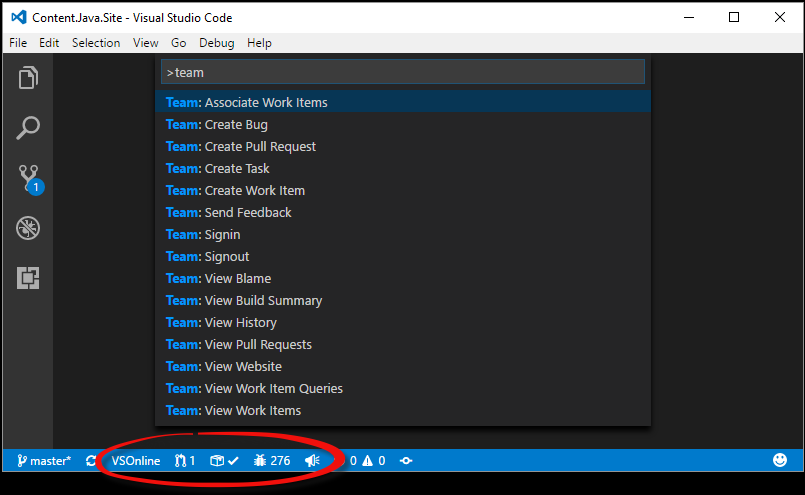

# Visual Studio Team Services Extension
### *The extension now supports Team Foundation Server 2015 Update 2 and later!*
This extension allows you to connect to Team Services, manage your pull requests for your Git repositories as well as monitor builds
and work items for your team project.  It  will use your local Git repository information to connect to either
Team Services or Team Foundation Server 2015 Update 2 (and later).



Here is the [Walkthrough of the Team Services extension for Visual Studio Code](https://www.youtube.com/watch?v=tpjj5i8f6BE)
video that shows many of the features of the extension.

**Note**: The extension does *not* support Team Foundation Version Control (TFVC) at this time.  Therefore, you must use the extension for your **Git** repositories.

## Prerequisites
### Visual Studio Team Services
If you are planning on using the extension with Git repositories hosted on Visual Studio Team Services, ensure you have a Team Services account.  If you do
not have a Team Services account, find out how to [sign up for Team Services](https://www.visualstudio.com/en-us/get-started/setup/sign-up-for-visual-studio-team-services).

### Team Foundation Server
If you are planning on using the extension with Git repositories on Team Foundation Server, you must be running Team Foundation
Server 2015 Update 2 or later.  Earlier versions of Team Foundation Server are not supported.

### Clone your Git repository
Since the extension uses the remote origin of your Git repository to determine how to connect to Team Services (or your Team Foundation Server), in most cases you will need to have
a Git repository already cloned locally.  If you intend on cloning an existing repository, do so before proceeding.  If you do not have a Git repository cloned locally but already
have a Team Services account (or a Team Foundation Server instance), you may create a local repository (via `git init`) and once you set the "origin" remote for that local repository,
the extension will detect the change to the remote and attempt to contact the Team Services account (or Team Foundation Server).

## Installation
First, you will need to install [Visual Studio Code](https://code.visualstudio.com/download) `1.7.0` or later.

To install the extension with the latest version of Visual Studio Code (version 1.9.0 is the latest as of this writing), bring up the Visual Studio Code Command Palette (`F1`),
type `install` and choose `Extensions: Install Extensions`.  In the `Search Extensions in Marketplace` text box, type `team`.  Find
the `Visual Studio Team Services` extension published by *Microsoft* and click the `Install` button.  Restart Visual Studio Code.

## Authentication
### Visual Studio Team Services
If you are connecting to Team Services, you will need a personal access token (PAT) to securely access your account. The latest
version of the extension will prompt for your token and store it securely. In previous versions of the extension, you needed to create a
token and store it in your Visual Studio Code user settings.

If you do not have a personal access token yet, you will need to create one on your Team Services account.
To create the token, go [here](https://aka.ms/gtgzt4) to learn how.
* When you create your token, create it with the **Build (read)**, **Code (read)** and **Work items (read)** scopes to ensure full functionality.
* You can also use *All Scopes*, but the minimum required scopes are those listed above.

### Team Foundation Server
If you are connecting to Team Foundation Server, you will only need your NTLM credentials (domain name, account name and password).

Details on how to connect to either Team Services or Team Foundation Server are found in the next section.

## Open a local Git Repository folder
Once you have installed the extension, open either the root folder or a sub-folder of the cloned Git repository.  Once a Team
Services or Team Foundation Server 2015 Update 2 (or later) repository is detected by the extension, you will need to provide
your credentials (if credentials weren't already found).  If you are required to provide your credentials, there will be an
indicator in the status bar whose message will indicate that you need to sign in.

The indicator looks like this:


To sign in to your account, run the `team signin` command.  If your repository is a Team Services repository,
you will be prompted to enter your personal access token.  When you do, it will be stored securely on your
computer and used to connect to Team Services.  If your repository is on Team Foundation Server 2015 Update
2 or later, you will be prompted to enter your username and password.  After both are provided, they will
be stored securely on your computer and used to connect to your TFS server.

Once your credentials are verified, the status bar indicators will be active and the remaining commands will
be ready to use.  The stored credentials will be used for each connection to the server until they are either
removed by the `team signout` command or overwritten by a subsequent `team signin` command.

**Note:** In order for the extension to be activated, a repository *folder* must be opened.  The extension
won't be activated if only a single *file* in the repository is opened.

## Status Bar Indicators
*  – This status bar item is populated with the name
of the team project to which the Git repository belongs.  Clicking on the item will open your browser to
the team website.

*  – This status bar item is a count of active
pull requests that you either requested yourself or were added to explicitly as a reviewer.  Clicking the
item will display that list of pull requests in the quick pick list.  Choosing one will take you to that
pull request in your browser.  This indicator will update its status every 5 minutes.

*  – This status bar item shows the status of
the build for this particular repository and branch.  Hovering over the item will provide additional
information about which build was referenced (if any).  Clicking on the item will take you to that build’s
summary page in your browser.  This indicator will update its status every 5 minutes.

*  – This status bar item shows
the number of items returned by your pinned work item query.  If you have not configured a pinned query it
defaults to the work items assigned to you. Clicking the item will show you the work items the query returns.
This indicator will update its status every 5 minutes.

## Commands
In addition to the status bar integrations, the extension also provides several commands for interacting with
Team Services and Team Foundation Server.  In the Command Palette (`F1`), type ```team``` and choose a command.

* `team create bug` – Opens your browser to the webpage used to create a new bug.  If a single line of text is
highlighted in Visual Studio Code, it will be used as the title of the bug.  The bug will be assigned to you.
You can then choose to update the fields, save, cancel, etc.

* `team create pull request` – Opens your browser for a new pull request based on the current repository and
branch.  Before creating the pull request, ensure that you save, commit and push any changes you have before
running the command.  Doing so will ensure that all of your latest changes are part of the pull request.

* `team create task` – Opens your browser to the webpage used to create a new task.  If a single line of text
is highlighted in Visual Studio Code, it will be used as the title of the task.  The task will be assigned to
you.  You can then choose to update the fields, save, cancel, etc.

* `team create work item` – Prompts you to choose a work item type from the list available in your team project.
Once you make a selection, your browser is opened to the webpage used to create the work item.  If a single line
f text is highlighted in Visual Studio Code, it will be used as the title of the task.  The work item will be
assigned to you.  You can then choose to update the fields, save, cancel, etc.

* `team send feedback` – Prompts you to either send a smile or a frown.  After choosing, you can provide us
feedback of up to 1000 characters.  Optionally, provide your email address so we can contact if you needed.  If
you do not want to provide your email address, just leave it empty (we'll still get your feedback).  *Note:*
Feedback can be sent even if telemetry reporting is disabled.

* `team signin` – Use this command to sign in to a Team Services account or Team Foundation Server 2015 Update 2
(and later) server.  When your credentials are provided, they will be stored securely on your computer.  The saved
credentials will be used for that account until they are removed by the `team signout` command or overwritten by a
subsequent `team signin` command.  See the "Secure Credential Storage" topic below for more details.

* `team signout` – Use this command to sign out from a Team Services account or Team Foundation Server 2015 Update 2
(and later) server.  Signing out will remove your credentials from your local computer.  To sign back in, you will
need to run the `team signin` command again.

* `team view blame` – If a file in the repository is opened in the editor, it will open your browser to the
blame page for that file in the current branch in the server repository.

* `team view build summary` – Same behavior as clicking on the Build Status status bar item.

* `team view history` – If a file in the repository is opened in the editor, it will open your browser to the
history page for that file in the current branch in the server repository.  Otherwise, the history of the current
branch in the server repository will be opened.

* `team login` – With version 1.113.0, this command is being deprecated in favor of `team signin`.  It will be removed in a future update.

* `team logout` – With version 1.113.0, this command is being deprecated in favor of `team signout`.  It will be removed in a future update.

* `team view pull requests` – Same behavior as clicking on the Pull Requests status bar item.

* `team view website` – Same behavior as clicking on the team project status bar item.

* `team view work items` – Prompts you to choose a work item that is assigned to you, sorted by ChangedDate descending.
Choosing a work item will open it in your browser.  This command will return a maximum of 200 results with an option
to "Browse additional work items...".  Choosing that option will open your browser to show all of the results of your query.

* `team view work item queries` – Prompts you to choose a query stored in your “My Queries” folder in your team project.
Choosing a query will run it and display the results in the Quick Pick list.  Choosing one of the results will open that
work item in your browser.    This command will return a maximum of 200 results with an option to "Browse additional
work items...".  Choosing that option will open your browser to show all of the results of your query.

## Secure Credential Storage
When you run the `team signin` command, the credentials that you provide will be stored securely on your computer.  On
Windows, your credentials wil be stored by Windows Credential Manager.  On OS X, your credentials will be stored in the
Keychain.  On Linux, your credentials will be stored in a file on your local file system in a subdirectory of your
home folder.  That file is created only with RW rights for the user running Visual Studio Code.  It is **not encrypted**
on disk.

## How to disable telemetry reporting
The Visual Studio Team Services extension collects usage data and sends it to Microsoft to help improve our products
and services.  Read our [privacy statement](http://go.microsoft.com/fwlink/?LinkId=528096&clcid=0x409) to learn more.

If you don’t wish to send usage data to Microsoft, add the following entry to User Settings (**File > Preferences > User Settings**):
```javascript
    "team.appInsights.enabled": "false"
```

## Polling interval
The polling interval for the pull request and build status bar indicators defaults to five minutes.  You can change this
value in the Visual Studio Code User Settings by adding an entry like the one below.  The minimum value is 1.
```javascript
"team.pollingInterval": 2
```

## Logging
There may be times when you need to enable file logging to troubleshoot an issue.  There are five levels of logging (`error`,
`warn`, `info`, `verbose` and `debug`).  Since logging is disabled by default, you can add an entry like the one shown below
to Visual Studio Code's User Settings.  Once you are finished logging, either remove the setting or set it to an empty string.
```javascript
"team.logging.level": "debug"
```
The log file will be placed at the root of your workspace and will be named `team-extension.log`.

## Pinned Work Item Queries
You can customize the pinned work item query by adding the following in the Visual Studio Code User Settings. You need to
provide the account and the query text or query path.  For Team Services, your account name can be of the form
`account.visualstudio.com` or simply `account`.  For Team Foundation Server, if your server URL is `http://servername:8080/tfs`
then the account name to use is `servername:8080`.

**Using Query Text**
  ```javascript
    "team.pinnedQueries": [
        {
            "account": "your-account-name",
            "queryText": "SELECT * FROM WorkItems WHERE [System.AssignedTo] = @me AND [System.ChangedDate] > @Today - 14"
        }
    ]
  ```
  
**Using Query Path**
  ```javascript
    "team.pinnedQueries": [
        {
            "account": "your-account-name",
            "queryPath": "Shared Queries/My Folder/My Query"
        }
    ]
  ```
  

You can also create a *global* pinned query which will be the default if you have not configured one for your account by
replacing *your-account-name* with *global* in the previous examples.

## Using External (non-Microsoft) Source Repositories
With version 1.113.0, you can now use the extension with repositories that are *not* hosted with either Team Services or Team Foundation Server.  You
will be able to monitor your builds (for a specific build definition) and work items that *are* hosted with either Team Services or Team Foundation
Server by specifying your account information.  To do this, set the following settings in VS Code.  It is recommended that you set these in your
Workspace Settings (and not User Settings).  You will, of course, still need to authenticate (provide credentials).

  ```javascript
    "team.remoteUrl": "https://account.visualstudio.com",
    "team.teamProject": "myTeamProject",
    "team.buildDefinitionId": 42,
  ```
  
To determine your build definition id, open the build summary for the build you'd like to monitor and grab the value of the _buildId=_ parameter in the url.

## Support
Support for this extension is provided on our [GitHub Issue Tracker](https://github.com/Microsoft/vsts-vscode/issues).  You
can submit a [bug report](https://github.com/Microsoft/vsts-vscode/issues/new), a [feature request](https://github.com/Microsoft/vsts-vscode/issues/new)
or participate in [discussions](https://github.com/Microsoft/vsts-vscode/issues).

## Contributing to the Extension
See the [developer documentation](CONTRIBUTING.md) for details on how to contribute to this extension.

## Code of Conduct
This project has adopted the [Microsoft Open Source Code of Conduct](https://opensource.microsoft.com/codeofconduct/). For more information see the [Code of Conduct FAQ](https://opensource.microsoft.com/codeofconduct/faq/) or contact [opencode@microsoft.com](mailto:opencode@microsoft.com) with any additional questions or comments.

## Privacy Statement
The [Microsoft Visual Studio Product Family Privacy Statement](http://go.microsoft.com/fwlink/?LinkId=528096&clcid=0x409)
describes the privacy statement of this software.

## License
This extension is [licensed under the MIT License](LICENSE.txt).  Please see the [third-party notices](ThirdPartyNotices.txt)
file for additional copyright notices and license terms applicable to portions of the software.
